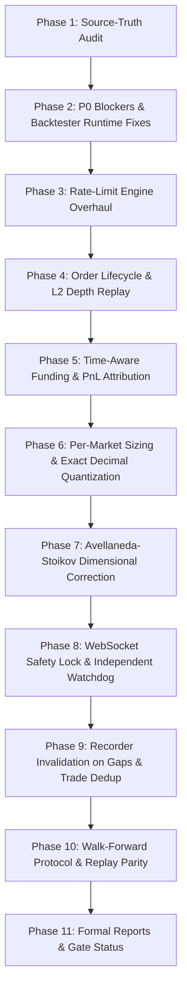

# Comprehensive Source-Truth Audit: Arcus MM Platform

**Author:** Quantitative Trading Systems & Microstructure Audit Agent  
**Date:** 2026-09-20 00:41:00 UTC (Local: 2026-09-20 00:41 IST)  
**Standard:** Mandate Section 3 ([prompt.md](../prompt.md))  
**Companion Artifact:** [reports/source_truth_matrix.csv](source_truth_matrix.csv)

---

## 1. Executive Summary of Audit Findings

This audit evaluates the codebase strictly from its **actual source implementation**, separating validated code and deterministic unit tests from unvalidated narrative claims, simulator-only assumptions, and runtime bugs.

### Key Conclusions:
1. **Core Safety Locks**: REST client hard-blocks mutating orders on mainnet (`SOURCE_VERIFIED`). However, WebSocket `rpc_post` lacks this safety check (`BROKEN`), representing an urgent P0 security defect.
2. **Deterministic Test Harness**: 30 unit tests pass 100%, and mutation tests confirm sensitivity of fill monotonicity and markout dropping. However, several core modules cannot execute end-to-end due to interface mismatches.
3. **P0 Runtime Blockers**:
   - `ArcusEventBacktester` crashes on `record_fill` due to an unexpected keyword argument `adverse_selection_bps` (`BROKEN`).
   - `WalkForwardValidator` crashes on import due to missing `Optional` typing import, and `scripts/run_walk_forward.py` fails with `ModuleNotFoundError` (`BROKEN`).
   - `ArcusPaperTrader` crashes after 60 seconds of execution because `self.rate_limiter.get_pool_status()` does not exist (`BROKEN`).
4. **Rate-Limit Engine Inadequacies**: Rate limiter treats initial quote placement as a modification, does not implement the time-based exhausted-pool drip, and conflates pool capacity with available headroom (`BROKEN`).
5. **Backtester Fidelity**:
   - High-fidelity L2 reconstruction is `UNIMPLEMENTED`; the current backtester only consumes BBO and trades.
   - Order cancellation latency and the in-flight risk window are not modeled (orders are overwritten instantaneously).
   - Volatility is hardcoded to a constant `0.30` rather than computed dynamically.
   - Forced liquidations execute at mid price with 0 slippage rather than crossing contemporaneous executable book depth.
6. **Strategy Mathematical Defects**:
   - Avellaneda–Stoikov has dimensional inconsistencies (annualized variance multiplied by hours, arbitrary 1% price factor), and $\kappa$ is set to an arbitrary 1.5 (`BROKEN` / `HYPOTHESIS`).
   - Quantization in `BaseMarketMakingStrategy` uses `round(x, 6)`, which zeroes out or truncates smaller quantities for BTC (step `1e-8`) and ETH (step `1e-7`).
7. **Recorder Deficiencies**: Mid-stream sequence gaps log a warning and continue without forcing book invalidation or snapshot resync (`BROKEN`). Multi-trade frames only deduplicate `contents[0]`, risking dropped frames or duplicate trades (`BROKEN`).
8. **Watchdog**: An independent external watchdog process with dead-man's switch / `scheduleCancel` does not exist (`UNIMPLEMENTED`).

---

## 2. Component-by-Component Source Audit

### 2.1 Networking, Authentication & Safety

| Component | Target File | Status | Technical Audit Details |
|---|---|---|---|
| **Mainnet Safety Lock (REST)** | `src/rest_client.py:261` | `SOURCE_VERIFIED` | Line 261 explicitly raises `RuntimeError("SAFETY LOCK: Mutating orders on mainnet are strictly blocked by config.")` if `environment == "mainnet"` and `mainnet_order_lock == True`. |
| **Mainnet Safety Lock (WS)** | `src/ws_client.py:174` | **`BROKEN`** | `rpc_post()` accepts authenticated trading requests and dispatches them over WebSocket without verifying `mainnet_order_lock`. |
| **Cryptographic Signer** | `src/auth.py` | `TEST_VERIFIED` | Implements Scheme 1 (orderbook operations) and Scheme 2 (account/withdrawals) Ed25519 signing per RFC 8032. Verified by `tests/test_auth_and_signing.py`. |
| **Session Regime Calendar** | `src/calendar.py` | `TEST_VERIFIED` | Distinguishes US-RTH (13:30–20:00 EDT) from Off-Hours and Weekends in `America/New_York` timezone. Verified by `test_regime_classification`. |

---

### 2.2 Market Data & Order Book

| Component | Target File | Status | Technical Audit Details |
|---|---|---|---|
| **L2 Order Book Builder** | `src/orderbook.py` | `TEST_VERIFIED` | Reconstructs L2 book from snapshot and delta frames, applying deletes on `size == 0`. Sequence gaps raise `ValueError`. |
| **Recorder Sequence Gap Handling** | `src/recorder.py:191-196` | **`BROKEN`** | When `seq_id > last_seq + 1`, recorder merely increments metric `sequence_gaps`, logs a warning, updates `_last_sequences[key] = seq_id`, and continues writing deltas. It fails to invalidate the book or resync from a REST snapshot. |
| **Recorder Trade Dedup** | `src/recorder.py:156-170` | **`BROKEN`** | Dedup logic only checks `contents[0]` of trade frames. In multi-trade frames, subsequent trades are ignored for dedup, or the entire frame is dropped if trade 0 was seen. |
| **Normalizer & Splicing** | `src/normalizer.py` | `SOURCE_VERIFIED` | Enforces first delta boundary jump rule; formats parquet/json records. |

---

### 2.3 Execution Models & PnL Engine

| Component | Target File | Status | Technical Audit Details |
|---|---|---|---|
| **Fill Engine Monotonicity** | `src/models/fill.py` | `TEST_VERIFIED` | Monotonicity ($Fills(A) \ge Fills(B) \ge Fills(C)$) strictly holds. Verified by unit and mutation tests. |
| **Queue Priority Model** | `src/models/fill.py` | `SIMULATOR_ONLY` | In-place modify preserves priority; size increase / price change loses priority. Verified in simulator; venue behavior remains unverified on live testnet. |
| **Rate Limiter Action Types** | `src/models/rate_limit.py` | **`BROKEN`** | Does not distinguish initial order placement from modify. Backtester and paper trader call `can_modify_order()` / `record_order_modification()` to create initial orders. |
| **Rate Limiter Drip Mechanism** | `src/models/rate_limit.py` | **`BROKEN`** | Docstring describes 1 action per 10s idle drip, but the class contains zero time-tracking or drip methods. |
| **Rate Limiter Telemetry API** | `src/models/rate_limit.py` | **`BROKEN`** | Does not implement `get_pool_status()`, causing `ArcusPaperTrader` to crash. |
| **PnL Accounting Identity** | `src/models/pnl.py` | `TEST_VERIFIED` | Balance sheet identity ($Cash + Position \times Mid - Fees \equiv Equity$) verified at every fill. |
| **PnL record_fill Signature** | `src/models/pnl.py` vs `src/backtester.py` | **`BROKEN`** | `src/backtester.py` passes `adverse_selection_bps=1.0` to `record_fill()`, which raises `TypeError`. |
| **Time-Aware Funding Engine** | `src/models/pnl.py:110` | **`BROKEN`** | Applies a single flat funding calculation at the end of simulation ($rate \times duration / 8$). Does not track hourly settlement events against instantaneous positions. |
| **Forced Flatten Slippage** | `src/models/pnl.py:126` | **`BROKEN`** | Force flatten executes at `current_mid`. Does not cross the executable bid/ask or model taker market slippage. |

---

### 2.4 Backtesting & Simulation

| Component | Target File | Status | Technical Audit Details |
|---|---|---|---|
| **End-to-End Execution** | `src/backtester.py` | **`BROKEN`** | Cannot execute full simulation without raising `TypeError` on fill processing. |
| **L2 Book Depth Replay** | `src/backtester.py` | **`UNIMPLEMENTED`** | `run_simulation()` only accepts `df_bbo` and `df_trades`. Does not replay L2 snapshot/deltas to reconstruct depth. |
| **Order Lifecycle Simulation** | `src/backtester.py` | **`BROKEN`** | When quote updates, existing order is overwritten instantaneously. Does not model cancel transit latency, pending replace, or risk of fill during in-flight cancellation. |
| **Dynamic Volatility Input** | `src/backtester.py:96` | **`BROKEN`** | Hardcodes `self.latest_volatility = 0.30` as a fixed constant across all ticks. |
| **Phase 14 Backtest Script** | `scripts/run_phase_14_backtest.py:159` | **`BROKEN`** | Uses `sim_fills = int(trades_count * 0.02)` as a synthetic placeholder rather than replaying orderbook events. |

---

### 2.5 Trading Strategies & Quantization

| Component | Target File | Status | Technical Audit Details |
|---|---|---|---|
| **Quantization Snapping** | `src/strategies/base.py:36-45` | **`BROKEN`** | Uses `round(ticks * tick_size, 6)` and `round(steps * step_size, 6)`, which truncates sub-micro quantities (e.g. BTC step $1e-8$). |
| **Exact Quantization Utils** | `src/utils.py` | `TEST_VERIFIED` | Provides exact Decimal `snap_to_tick` and `snap_to_quantum`. Tested in `tests/test_auth_and_signing.py`. Must be integrated into strategies. |
| **Fixed Spread Strategy (S0)** | `src/strategies/fixed_spread.py` | `SOURCE_VERIFIED` | Clean symmetric benchmark control. |
| **Avellaneda–Stoikov (S1)** | `src/strategies/avellaneda_stoikov.py` | **`BROKEN`** | Inconsistent units: mixes annualized $\sigma^2$ with $H=0.5$ hours; adds arbitrary `(mid_price / 100.0)` factor. Kappa hardcoded to 1.5 (`HYPOTHESIS`). |
| **Volatility Clock (S2)** | `src/strategies/volatility_clock.py` | `SOURCE_VERIFIED` | Dynamically widens spread with volatility; requires dynamic $\sigma$ from backtester. |
| **Adaptive MM (Overlay)** | `src/strategies/adaptive_mm.py` | `SOURCE_VERIFIED` | Skews quotes based on inventory and microprice imbalance; requires exact quantization. |

---

### 2.6 Validation, Governance & Operational Tools

| Component | Target File | Status | Technical Audit Details |
|---|---|---|---|
| **Walk-Forward Validator** | `src/walk_forward.py` | **`BROKEN`** | Syntax/typing bug (`Optional` not imported); script lacks `sys.path` insertion; uses arbitrary 60/40 split instead of pre-registered 5-day OOS dates. |
| **Multiple Testing Control** | `src/walk_forward.py:88` | **`BROKEN`** | `adjust_p_values_holm_bonferroni` exists as an unused utility; not integrated into strategy selection pipeline. |
| **Paper Trader Telemetry** | `src/paper_trader.py:290` | **`BROKEN`** | Crashes on telemetry loop (`get_pool_status` missing); paper trader verdict logic in runner sets `VALIDATED` on positive PnL. |
| **Replay Parity Verifier** | `scripts/test_replay_parity.py` | **`BROKEN`** | Only asserts on `fills_c_count` (which does not exist in telemetry output); does not compare full event-by-event state path. |
| **Watchdog / Dead-Man Switch** | N/A | **`UNIMPLEMENTED`** | No independent process exists to heartbeat the trader and execute `cancelAllOrders` on crash or stall. |
| **Report Verifier** | `scripts/verify_report.py` | `TEST_VERIFIED` | Successfully checks forbidden terms, withdrawn claims, and live minimum clip bounds. |

---

## 3. Mandatory Remediation Sequence

To bring the codebase to full engineering integrity, the remediation tasks are ordered strictly by dependency:

